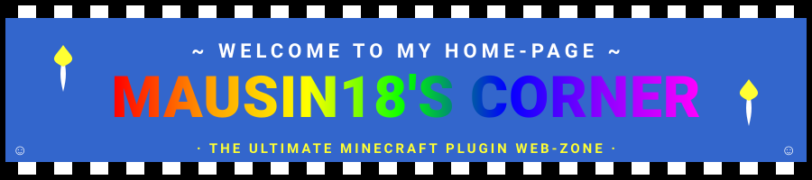
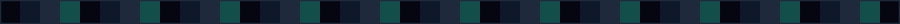

  

  

  
  
  

<blockquote>
  
<b>📟 ¡bienvenido a mi página web!</b> aquí se muestra lo que hago: plugins de minecraft, la red satelitecraft y demás chunches. la página sigue en obras, como este perfil.

</blockquote>

  

<h2 align="center">🔍 ¿quién es este tipo?</h2>

<pre>
🛰  red de minecraft : satelitecraft (1.8 → 26.2+)
🧩  plugins         : java · paper · spigot · bungeecord
🔨  build           : maven · gradle · mysql · redis
🎯  especialidad    : pvp, sistemas y optimización
</pre>

  

<h2 align="center">📞 contacto y redes</h2>

  
  
  
  

  

<h2 align="center">🔧 la caja de herramientas</h2>

  
  
  
  
  
  
  
  
  

  

<h2 align="center">📖 libro de visitas</h2>

  

<blockquote>
  
¿ya viste todo? firma el libro de visitas y vuelve mañana, que actualizo seguido. (con navegador de la época se aprecia mejor).

</blockquote>

  

<h2 align="center">🐍 la mascota de la página</h2>

  

  

<blockquote>
  
<i>"Los buenos servidores y los buenos plugins se hacen con paciencia... y café."</i>

</blockquote>

  © 1998–2026 Mausin18 · mejor visto a 800×600 con Internet Explorer · página hecha 100% a mano

